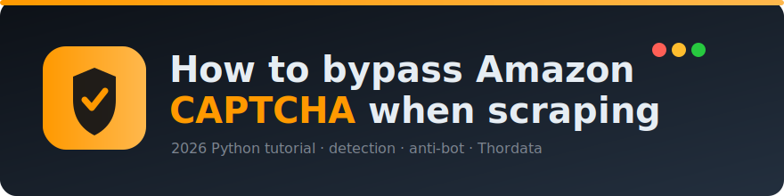

<div align="center">



[](https://github.com/Thordata/how-to-bypass-amazon-captcha-when-scraping/actions/workflows/ci.yml)
[](https://thordata.github.io/how-to-bypass-amazon-captcha-when-scraping/)
[](https://www.python.org/)
[](LICENSE)

<h3>实战优先的 Python 教程：用免费工具检测 Amazon CAPTCHA,理解现代反爬,并用 Thordata Web Scraper Tools 获取稳定结构化数据。</h3>

[🌐 文档站](https://thordata.github.io/how-to-bypass-amazon-captcha-when-scraping/) · [🎮 在线演示](https://thordata.github.io/how-to-bypass-amazon-captcha-when-scraping/playground.html) · [📘 English](README.md)

</div>

---

> **🌍 语言:** [English](README.md) · 中文

## 这是什么

一份实战优先的教程,讲解**抓取时 Amazon CAPTCHA 是如何被触发的**、用**纯 Python 和免费工具**能做什么,以及何时该切换到 **Thordata Web Scraper Tools** 这类托管方案。

- **Part 1(约 80%)—— 免费、手动方案**:用 `requests` 搭一个会撞上 CAPTCHA 的爬虫,学会检测它,并理解为什么手动技巧很脆弱。
- **Part 2(约 20%)—— Thordata 托管方案**:通过官方 Python SDK 调用 Amazon 工具,IP 轮换、无头浏览器、CAPTCHA 处理都被封装在底层。

完整教程在**[文档站](https://thordata.github.io/how-to-bypass-amazon-captcha-when-scraping/)**上,本 README 是快速上手指南。

## ✨ 功能特性

- 🛡️ **CAPTCHA 检测库** —— 内容 + 状态码启发式判定,结构化 `DetectionResult`,4 级风险评分
- 🔄 **请求头轮换池** —— 精选浏览器画像(Chrome/Edge/Firefox),`Sec-CH-UA` 配套头一致
- 🔁 **带重试的抓取器** —— 指数退避、每次请求轮换请求头、CAPTCHA 感知重试
- 📦 **批量处理** —— 有界并发、进度条、逐项容错
- 💾 **JSON/CSV 导出** —— 稳定的 Amazon 商品字段顺序
- 🖥️ **统一 CLI** —— `python -m amazon_captcha {detect|fetch|batch|export}`
- 🎮 **交互式 Playground** —— 100% 前端检测演示,与 Python 的 marker 列表完全一致
- 🧪 **离线测试套件** —— 36 个测试,无真实网络请求

## 🚀 快速开始

```bash
# 克隆
git clone https://github.com/Thordata/how-to-bypass-amazon-captcha-when-scraping.git
cd how-to-bypass-amazon-captcha-when-scraping

# 安装包(可编辑模式 + 开发工具)
pip install -e ".[dev]"

# 使用 CLI
python -m amazon_captcha --help
echo "<html><body>type the characters you see in this image</body></html>" \
  | python -m amazon_captcha detect --status 503
```

运行示例脚本:

```bash
python examples/amazon_captcha_detect.py        # 检测真实响应中的 CAPTCHA
python examples/retry_backoff_demo.py           # 重试 + 退避 + 请求头轮换
python examples/curl_cffi_tls_demo.py           # TLS/JA3 指纹伪装(需 curl_cffi)
python examples/playwright_stealth_demo.py      # 隐身无头浏览器(需 playwright)
```

Thordata 托管方案:

```bash
pip install -e ".[thordata]"
# 创建 .env,填入 THORDATA_SCRAPER_TOKEN / THORDATA_PUBLIC_TOKEN / THORDATA_PUBLIC_KEY
python examples/thordata_amazon_product_by_asin.py
```

## 📁 仓库结构

```
amazon_captcha/          # 可安装包
├── detect.py            # CAPTCHA markers、风险等级、DetectionResult
├── headers.py           # 浏览器画像池 + 轮换
├── fetch.py             # 带重试的抓取器
├── export.py            # JSON/CSV 导出
├── batch.py             # 有界并发批量执行
├── thordata_client.py   # 带 env 校验的 Thordata 封装
└── cli.py               # 统一 CLI
examples/                # 可运行示例(从入门到进阶)
tests/                   # 离线 pytest 测试套件
docs/                    # GitHub Pages 源码(文档站 + playground)
images/                  # 流程图 + 横幅
```

## 🧪 测试与 lint

```bash
pytest -ra               # 36 个离线测试
ruff check .             # lint
ruff format --check .    # 格式检查
```

CI 在 Python 3.10 / 3.11 / 3.12 上对每次 push 和 PR 运行。

## 🛡️ 手动 vs. Thordata(CAPTCHA 维度)

| 维度 | 手动方案(Part 1) | Thordata(Part 2) |
|---|---|---|
| 反爬 / CAPTCHA | 频繁撞 CAPTCHA | 内部处理 |
| 请求头 & cookies | 手动管理 | 自动调优 |
| IP / 代理管理 | 自行获取并轮换 | 平台负责池与轮换 |
| 解析工作量 | 解析 HTML、应对改版 | 消费稳定 JSON |
| 适用场景 | 实验、学习 | 商业 / 大规模 |

## ⚖️ 免责与合规

本仓库**仅供技术学习与研究**。请始终遵守 Amazon 的服务条款、robots 规则及当地法律。不要使目标站点过载、受损或中断。商业或大规模使用应考虑合规的托管方案,如有疑问请咨询法律意见。作者与 Thordata 不提供法律建议,也不对滥用承担责任。详见 [SECURITY.md](SECURITY.md) 与[法律声明](https://thordata.github.io/how-to-bypass-amazon-captcha-when-scraping/#legal)。

## 📚 相关 Thordata 资源

- **Thordata GitHub:** [github.com/Thordata](https://github.com/Thordata)
- **Python SDK:** [thordata-python-sdk](https://github.com/Thordata/thordata-python-sdk)
- **官网:** [thordata.com](https://www.thordata.com)

## 🤝 贡献

欢迎贡献 —— 见 [CONTRIBUTING.md](CONTRIBUTING.md)。请遵守 [行为准则](CODE_OF_CONDUCT.md)。

## 📄 许可证

[MIT](LICENSE) © Thordata
